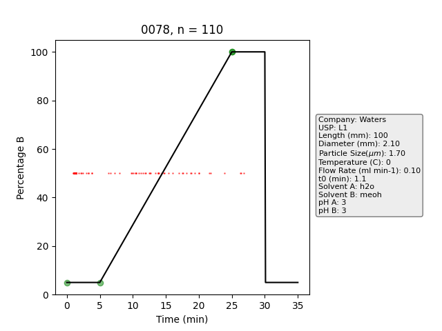

 

# **[From Reverse Phase Chromatography to HILIC: Graph Transformers Power Method-Independent Machine Learning of Retention Times](https://pubs.acs.org/doi/10.1021/acs.analchem.4c05859)**


# General
Graphormer-RT is an extension to the Graphormer package, with [documentation](https://graphormer.readthedocs.io/), and the original code on [Github](https://github.com/microsoft/Graphormer/) with additional usage examples. If you use this code, __please cite our work that led to the development of this platform and the original Graphormer__


@article{Stienstra2025,
   author = {Cailum M.K. Stienstra and Emir Nazdrajić and W. Scott Hopkins},
   doi = {10.1021/ACS.ANALCHEM.4C05859},
   issn = {15206882},
   journal = {Analytical Chemistry},
   publisher = {American Chemical Society},
   title = {From Reverse Phase Chromatography to HILIC: Graph Transformers Power Method-Independent Machine Learning of Retention Times},
   url = {https://pubs.acs.org/doi/abs/10.1021/acs.analchem.4c05859},
   year = {2025},
}

@article{Stienstra2025,
   author = {Cailum M.K. Stienstra and Teun van Wieringen and Liam Hebert and Patrick Thomas and Kas J. Houthuijs and Giel Berden and Jos Oomens and Jonathan Martens and W. Scott Hopkins},
   doi = {10.1021/ACS.JCIM.4C02329},
   issn = {1549960X},
   journal = {Journal of Chemical Information and Modeling},
   publisher = {American Chemical Society},
   title = {A Machine-Learned “Chemical Intuition” to Overcome Spectroscopic Data Scarcity},
   volume = {65},
   url = {https://pubs.acs.org/doi/full/10.1021/acs.jcim.4c02329},
   year = {2025},
}

@article{Stienstra2024,
   author = {Cailum M. K. Stienstra and Liam Hebert and Patrick Thomas and Alexander Haack and Jason Guo and W. Scott Hopkins},
   doi = {10.1021/ACS.JCIM.4C00378},
   issn = {1549-9596},
   journal = {Journal of Chemical Information and Modeling},
   month = {6},
   publisher = {American Chemical Society},
   title = {Graphormer-IR: Graph Transformers Predict Experimental IR Spectra Using Highly Specialized Attention},
   url = {https://pubs.acs.org/doi/abs/10.1021/acs.jcim.4c00378},
   year = {2024},
}

@inproceedings{
ying2021do,
title={Do Transformers Really Perform Badly for Graph Representation?},
author={Chengxuan Ying and Tianle Cai and Shengjie Luo and Shuxin Zheng and Guolin Ke and Di He and Yanming Shen and Tie-Yan Liu},
booktitle={Thirty-Fifth Conference on Neural Information Processing Systems},
year={2021},
url={https://openreview.net/forum?id=OeWooOxFwDa}
}


# Installation
## Docker via Dev Containers (VSCode) [April 2025]
We have developed a Docker Image to make installation and management of environments easier for Graphormer-RT using the Dev Containers extension in VSCode. Installation instructions are as follows:

### 🧰 Prerequisites
Install the following software (if not already installed):
- Docker: https://docs.docker.com/get-docker/
- NVIDIA GPU drivers: https://www.nvidia.com/Download/index.aspx
- NVIDIA Container Toolkit: https://docs.nvidia.com/datacenter/cloud-native/container-toolkit/install-guide.html
- Dev Containers Extension: https://marketplace.visualstudio.com/items?itemName=ms-vscode-remote.remote-containers

You can verify installation via the following commands: 
```bash
docker --version
```
```bash
nvidia-smi
```
```bash
nvidia-container-cli --version
```

### 📁 Folder Structure

Your main project folder (e.g. `Graphormer-RT/`) should look like this:

<pre lang="markdown"> <code> Graphormer-RT/ 
  ├── .devcontainer/ 
  │ ├── devcontainer.json 
  │ ├── Dockerfile       
  ├── model_weights/
  │ ├── best_model.pt
  │ ├── last_model.pt           </code> </pre>

The `devcontainer.json` file is used by Dev Containers to build the container:
```bash
{
    "name": "Graphormer-RT",
    "build": {
        "dockerfile": "Dockerfile",
        "context": ".."
    },
    "runArgs": [
      "--gpus", "all",
      "--name", "graphormer-rt"
    ],
    "customizations": {
        "vscode": {
          "settings": {
            "python.defaultInterpreterPath": "/opt/conda/envs/graphormer-rt/bin/python",
            "python.terminal.activateEnvironment": true
          },
          "extensions": [
            "ms-python.python"
          ]
        }
      },
    "workspaceFolder": "/workspace/Graphormer-RT",
    "mounts": [
      "source=${localWorkspaceFolder}/model_weights,target=/workspace/Graphormer-RT/model_weights,type=bind,consistency=cached"
    ],
    "remoteUser": "root",
    "overrideCommand": true
  }
  
```
Updated `Dockerfile` (for consistent CUDA versions):
```bash
# Use an NVIDIA CUDA runtime image that provides the necessary libraries (e.g. cuBLAS)
FROM nvidia/cuda:12.1.0-runtime-ubuntu22.04

# Prevent tzdata from prompting during installation and set timezone
ENV DEBIAN_FRONTEND=noninteractive
ENV TZ=Etc/UTC

# Set CUDA identifier for PyG wheels; adjust if needed (e.g. to cu121)
ENV CUDA=cu121

# Install system packages (including wget, git, build-essential, and ca-certificates)
RUN apt-get update && apt-get install -y \
    wget \
    git \
    build-essential \
    ca-certificates \
    && rm -rf /var/lib/apt/lists/*

# Install Miniconda
RUN wget https://repo.anaconda.com/miniconda/Miniconda3-latest-Linux-x86_64.sh && \
    bash Miniconda3-latest-Linux-x86_64.sh -b -p /opt/conda && \
    rm Miniconda3-latest-Linux-x86_64.sh

# Update PATH to include conda and create a conda environment
ENV PATH="/opt/conda/bin:$PATH"
RUN conda create -n graphormer-rt python=3.9.18 -y && \
    /opt/conda/envs/graphormer-rt/bin/pip install --upgrade pip

# Make the conda environment the default by prepending its bin directory to PATH
ENV PATH="/opt/conda/envs/graphormer-rt/bin:$PATH"
ENV CONDA_DEFAULT_ENV=graphormer-rt

WORKDIR /workspace

# Cache-busting ARG: update this value manually when you want to re-download the repository
ARG CACHEBUST=1
# Remove any existing clone (if present) and clone the latest repository
RUN rm -rf Graphormer-RT && git clone https://github.com/HopkinsLaboratory/Graphormer-RT.git

# Install fairseq (switch to the fairseq subdirectory)
WORKDIR /workspace/Graphormer-RT/fairseq

# Downgrade pip so that omegaconf versions used by fairseq are accepted
RUN pip install --upgrade "pip<24.1"

# Install fairseq from the current repository in editable mode (this builds its extensions)
RUN pip install --editable ./

# Install dependencies

# Install DGL using the appropriate wheel URL (for torch-2.1 and cu118)
RUN pip install dgl==1.1.3+${CUDA} -f https://data.dgl.ai/wheels/${CUDA}/repo.html

# Install torch-geometric; here we pin a version that works with our setup (e.g. 2.4.0)
RUN pip install torch-geometric==2.4.0

# Install torch-scatter and torch-sparse wheels built for torch-2.1.0+cu118
RUN pip install torch-scatter torch-sparse -f https://data.pyg.org/whl/torch-2.1.0+${CUDA}.html

# Install additional dependencies
RUN pip install ogb==1.3.2
RUN pip install rdkit-pypi==2022.9.5
RUN pip install matplotlib
RUN pip install numpy==1.23
RUN pip install dgllife==0.3.2
RUN pip install mordred==1.2.0
RUN pip install torchaudio==2.1.0
RUN pip install rdkit==2023.9.1
RUN pip install rdkit-pypi==2022.9.5
# RUN pip install dgl==1.1.3

# Set working directory back to the repository root
WORKDIR /workspace/Graphormer-RT

# Set the default command to launch an interactive bash shell (the conda environment is already active)
CMD ["/bin/bash"]
```

### 🚀 Setup Steps
1. Save the Dockerfile (the name should be "Dockerfile") and `devcontainer.json` inside `.devcontainer` as above.
2. Save the pretrained model weights into `model_weights` inside the project folder.
3. Open the project folder in a **new VSCode window**.
4. Press `F1` and select:
   ➜ `Dev Containers: Rebuild Container without Cache and Reopen in Container`
5. Once it finishes building, open a new terminal to run the code. 
6.	Navigate to the example directory, make the example script executable, and run the example script:
```bash
cd /workspace/Graphormer-RT/examples/property_prediction
chmod +x HILIC.sh  
./HILIC.sh
```
7.	If it runs for an epoch and saves .pt files, you know you’ve succeeded.


## Docker [April 2025]
We have developed a Docker Image to make installation and management of environments easier for Graphormer-RT. Installation instructions are as follows:

📦 How to Install and Run Graphormer-RT Using Docker Image
1.	Install the following software (if not already installed):
- Docker: https://docs.docker.com/get-docker/
- NVIDIA GPU drivers: https://www.nvidia.com/Download/index.aspx
- NVIDIA Container Toolkit: https://docs.nvidia.com/datacenter/cloud-native/container-toolkit/install-guide.html

You can verify installation via the following commands: 
```bash
docker --version
```
```bash
nvidia-smi
```
```bash
nvidia-container-cli --version
```

2.	Save the Dockerfile (the name should be “Dockerfile”).
3.	Open a terminal in the same folder as Dockerfile.
4.	Build the Docker image by running:
```bash
docker build --no-cache -t graphormer-rt .
```
5.	Run the Docker container with GPU support:
```bash
docker run -it --gpus all graphormer-rt bash
```
6.	Inside the container, navigate to the example directory, make the example script executable, and run the example script:
```bash
cd /workspace/Graphormer-RT/examples/property_prediction
chmod +x HILIC.sh  
./HILIC.sh
```
7.	If it runs for an epoch and saves .pt files, you know you’ve succeeded. 

A beginner's guide to Docker usage can be found [HERE](https://docker-curriculum.com/)

- To Upload files (e.g., new data) to the docker container, use:
```bash
docker cp ./local_file.txt container_id:/app/local_file.txt
```
- To Download files (checkpoints, results) from this container, use:
```bash
docker cp <container_id>:<path_inside_container> <path_on_host> 
```
## Old Instructions [Before April 2025]
We highly recommend following the [installation guide](https://graphormer.readthedocs.io/), though we will suggest a few additional notes to make things easier:
- Install fairseq directly from the [Github repository](https://github.com/facebookresearch/fairseq), "pip install -e /path/to/folder" Make sure that you're using an old enough version that's compatible with Graphormer
- Make sure that you're using an old enough version of PyTorch Geometric and the DGL libraries (there's a lookup table for compatibility on their website). These are the things that we found broke the most frequently, and the errors you get don't always tell you that it's these packages. If there are problems inheriting abstract data classes, just modify the class methods to include whatever class methods (e.g., "\_\_len\_\_"), in your install and it should work.
- Refer to "requirement.txt" if you have any problems with version compatability.
- Ensure that your CUDA and pytorch geometric versions are compatabile. 

# Data
All data used in this study is publically available at the RepoRT github (https://github.com/michaelwitting/RepoRT/). Those using this data should cite this work as follows:

@article{Kretschmer2024,
   author = {Fleming Kretschmer and Eva Maria Harrieder and Martin A. Hoffmann and Sebastian Böcker and Michael Witting},
   doi = {10.1038/s41592-023-02143-z},
   issn = {1548-7105},
   issue = {2},
   journal = {Nature Methods 2024 21:2},
   keywords = {Analytical biochemistry,Databases,Metabolomics},
   month = {1},
   pages = {153-155},
   pmid = {38191934},
   publisher = {Nature Publishing Group},
   title = {RepoRT: a comprehensive repository for small molecule retention times},
   volume = {21},
   url = {https://www.nature.com/articles/s41592-023-02143-z},
   year = {2024},
}

All of our training libraries for this study can be directly obtained from their library, by utilizing the dataprocessing scripts outlined in the folder. These 
scripts need their paths to be manually modified to received a "RepoRT-like" data structure. If you wish to adapt your gradient/LC method to our model, I highly recommend
structuring your data like a RepoRT entry and apply our scripts to generate an entry in our method data dictionary.

The pickle files (/home/cmkstien/RT_pub/Graphormer_RT/sample_data/HILIC_metadata.pickle, /home/cmkstien/RT_pub/Graphormer_RT/sample_data/RP_metadata.pickle) contain
processed column metada generated from RepoRT with the following header:

['company_name', 'usp_code', 'col_length', 'col_innerdiam', 'col_part_size', 'temp', 'col_fl', 'col_dead', 'HPLC_type','A_solv', 'B_solv', 'time1', 'grad1', 'time2', 'grad2', 'time3', 'grad3', 'time4', 'grad4', 'A_pH', 'B_pH', 'A_start', 'A_end', 'B_start', 'B_end',  'eluent.A.formic', 'eluent.A.formic.unit', 'eluent.A.acetic', 'eluent.A.acetic.unit','eluent.A.trifluoroacetic', 'eluent.A.trifluoroacetic.unit','eluent.A.phosphor', 'eluent.A.phosphor.unit','eluent.A.nh4ac','eluent.A.nh4ac.unit', 'eluent.A.nh4form','eluent.A.nh4form.unit','eluent.A.nh4carb', 'eluent.A.nh4carb.unit','eluent.A.nh4bicarb','eluent.A.nh4bicarb.unit', 'eluent.A.nh4f','eluent.A.nh4f.unit','eluent.A.nh4oh', 'eluent.A.nh4oh.unit','eluent.A.trieth','eluent.A.trieth.unit','eluent.A.triprop','eluent.A.triprop.unit','eluent.A.tribut', 'eluent.A.tribut.unit','eluent.A.nndimethylhex', 'eluent.A.nndimethylhex.unit','eluent.A.medronic', 'eluent.A.medronic.unit','eluent.B.formic', 'eluent.B.formic.unit', 'eluent.B.acetic', 'eluent.B.acetic.unit','eluent.B.trifluoroacetic', 'eluent.B.trifluoroacetic.unit','eluent.B.phosphor', 'eluent.B.phosphor.unit','eluent.B.nh4ac','eluent.B.nh4ac.unit', 'eluent.B.nh4form','eluent.B.nh4form.unit','eluent.B.nh4carb', 'eluent.B.nh4carb.unit','eluent.B.nh4bicarb','eluent.B.nh4bicarb.unit', 'eluent.B.nh4f','eluent.B.nh4f.unit','eluent.B.nh4oh', 'eluent.B.nh4oh.unit','eluent.B.trieth','eluent.B.trieth.unit', 'eluent.B.triprop','eluent.B.triprop.unit','eluent.B.tribut', 'eluent.B.tribut.unit','eluent.B.nndimethylhex', 'eluent.B.nndimethylhex.unit','eluent.B.medronic', 'eluent.B.medronic.unit', 'kPB', 'αCH2', 'αT/O', 'αC/P', 'αB/P', 'αB/P.1', 'particle size', 'pore size', 'H', 'S*', 'A', 'B', 'C (pH 2.8)', 'C (pH 7.0)', 'EB retention factor']

Some of these parameters (like void volume of HSMB/Tanaka parameters), are calculated directly using RepoRT scripts. Not all this data is given to our model (see main script), and replacing values that are not present with a '0' will allow models to learn. See publication for more details.

# Custom Gradients (April 7th, 2025)

Our model uses all shown in the following figure in our encoding schemes 
 

(Along with several calculated column parameters from the RepoRT workflow)

We have built a script (scripts/update_dictionary_new_method.py) that has a template for adding a new method to our dictionary to facilitate the addition of new gradients for downstream finetuning applications

# Usage
Sample data for generating 'specialist' and 'generalist' models is found the sample_data folder and demonstrates the intended structure. 

The example/property_predicton/ folder contains scripts and dataloaders to a) pre-train a RP/HILIC model and b)finetune a pre-existing model to generate a specialist model. If you want to change the datasoure, you will need to edit code in the dataloader. Details for recommended hyperparameters are found in the main paper published in Analytical Chemistry.

>> bash ../../examples/property_prediction/RP.sh  

for fully pretraining a model, assuming you've edited the dataloader

>> bash ../../examples/property_prediction/finetune_RP.sh  

for finetuning a model if you have put model weights in the right place and edited the dataloader

Models can then be evaluated using the corresponding scripts in the graphormer/evaluate/. The flag '--save-dir' will allow you to save predictions alongside method data and SMILES codes. 

>> bash ../../graphormer/evaluate_RP.sh  

Pre-graph encoders are found in graphormer/modules/graphormer_layers.py

Graph layers and MLPs are found in graphormer/models/

There are command line tools available for freezing layers of the graph encoder of MLP (see freeze-level). A negative freeze-level will freeze layers of the graph encoder starting from the front (-4 freezes the first 4 layers of the graph encoder). A positive freeze level will freeze layers in the MLP starting from the front (2 will freeze the first two layers of the MLP). There are additionally flags for freezing the atomic feature encoders and graph feature encoders.

# Models

Sample RP and HILIC models that were pretrained for our study are freely available online at [Zenodo](https://zenodo.org/records/15021743). These can be used for model 
evaluation or for finetuning using the requisite scripts. 

# Common Errors

"Segmentation Fault... Core Dumped" may indicate that you have installed the incorrect version of PyTorch Geometric (https://data.pyg.org/whl/). This can be further tested by checking the package import (e.g., from pytorch_geometric.data import data)

If gradients explode in training, it is recommended that you lower learning rates or increase the fp16-scale-tolerance value in the bash script

# Contact

If you require further assistance with developing your own model or have any questions about its implementaton, the authors can be contacted at 

- cmkstien@uwaterloo.ca
- scott.hopkins@uwaterloo.ca 

