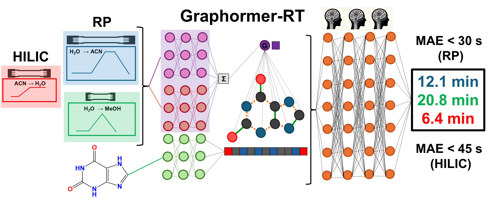

 

Code to accompany manuscript from https://pubs.acs.org/doi/10.1021/acs.analchem.4c05859

# General
Graphormer-RT is an extension to the Graphormer package, with [documentation](https://graphormer.readthedocs.io/), and the original code on [Github](https://github.com/microsoft/Graphormer/) with additional usage examples. If you use this code, __please cite our work that led to the developement of this platform and the original Graphormer__

@article{Stienstra2025,
   author = {Cailum M.K. Stienstra and Emir Nazdrajić and W. Scott Hopkins},
   doi = {10.1021/ACS.ANALCHEM.4C05859/SUPPL_FILE/AC4C05859_SI_001.PDF},
   issn = {15206882},
   journal = {Analytical Chemistry},
   publisher = {American Chemical Society},
   title = {From Reverse Phase Chromatography to HILIC: Graph Transformers Power Method-Independent Machine Learning of Retention Times},
   url = {https://pubs.acs.org/doi/abs/10.1021/acs.analchem.4c05859},
   year = {2025},
}

@article{Stienstra2025,
   author = {Cailum M.K. Stienstra and Teun van Wieringen and Liam Hebert and Patrick Thomas and Kas J. Houthuijs and Giel Berden and Jos Oomens and Jonathan Martens and W. Scott Hopkins},
   doi = {10.1021/ACS.JCIM.4C02329},
   issn = {1549960X},
   journal = {Journal of Chemical Information and Modeling},
   publisher = {American Chemical Society},
   title = {A Machine-Learned “Chemical Intuition” to Overcome Spectroscopic Data Scarcity},
   volume = {65},
   url = {https://pubs.acs.org/doi/full/10.1021/acs.jcim.4c02329},
   year = {2025},
}

@article{Stienstra2024,
   author = {Cailum M. K. Stienstra and Liam Hebert and Patrick Thomas and Alexander Haack and Jason Guo and W. Scott Hopkins},
   doi = {10.1021/ACS.JCIM.4C00378},
   issn = {1549-9596},
   journal = {Journal of Chemical Information and Modeling},
   month = {6},
   publisher = {American Chemical Society},
   title = {Graphormer-IR: Graph Transformers Predict Experimental IR Spectra Using Highly Specialized Attention},
   url = {https://pubs.acs.org/doi/abs/10.1021/acs.jcim.4c00378},
   year = {2024},
}

@inproceedings{
ying2021do,
title={Do Transformers Really Perform Badly for Graph Representation?},
author={Chengxuan Ying and Tianle Cai and Shengjie Luo and Shuxin Zheng and Guolin Ke and Di He and Yanming Shen and Tie-Yan Liu},
booktitle={Thirty-Fifth Conference on Neural Information Processing Systems},
year={2021},
url={https://openreview.net/forum?id=OeWooOxFwDa}
}

# Installation
We highly recommend following the [installation guide](https://graphormer.readthedocs.io/), though we will suggest a few additional notes to make things easier (including how to properly make a virtual environment)
- Install fairseq directly from the [Github repository](https://github.com/facebookresearch/fairseq), "pip install -e /path/to/folder" Make sure that you're using an old enough version that's compatible with Graphormer
- Make sure that you're using an old enough version of PyTorch Geometric and the DGL libraries (there's a lookup table for compatibility on their website). These are the things that we found broke the most frequently, and the errors you get don't always tell you that it's these packages. If there are problems inheriting abstract data classes, just modify the class methods to include whatever class methods (e.g., "\_\_len\_\_"), in your install and it should work.
- Refer to "requirement.txt" if you have any problems with version compatability.
- Ensure that your CUDA and pytorch geometric versions are compatabile. 

# Data
All data used in this study is publically available at the RepoRT github (https://github.com/michaelwitting/RepoRT/). Those using this data should cite this work as follows:

@article{Kretschmer2024,
   author = {Fleming Kretschmer and Eva Maria Harrieder and Martin A. Hoffmann and Sebastian Böcker and Michael Witting},
   doi = {10.1038/s41592-023-02143-z},
   issn = {1548-7105},
   issue = {2},
   journal = {Nature Methods 2024 21:2},
   keywords = {Analytical biochemistry,Databases,Metabolomics},
   month = {1},
   pages = {153-155},
   pmid = {38191934},
   publisher = {Nature Publishing Group},
   title = {RepoRT: a comprehensive repository for small molecule retention times},
   volume = {21},
   url = {https://www.nature.com/articles/s41592-023-02143-z},
   year = {2024},
}

All of our training libraries for this study can be directly obtained from their library, by utilizing the dataprocessing scripts outlined in the folder. These 
scripts need their paths to be manually modified to received a "RepoRT-like" data structure. If you wish to adapt your gradient/LC method to our model, I highly recommend
structuring your data like a RepoRT entry and apply our scripts to generate an entry in our method data dictionary.

The pickle files (/home/cmkstien/RT_pub/Graphormer_RT/sample_data/HILIC_metadata.pickle, /home/cmkstien/RT_pub/Graphormer_RT/sample_data/RP_metadata.pickle) contain
processed column metada generated from RepoRT with the following header:

['company_name', 'usp_code', 'col_length', 'col_innerdiam', 'col_part_size', 'temp', 'col_fl', 'col_dead', 'HPLC_type','A_solv', 'B_solv', 'time1', 'grad1', 'time2', 'grad2', 'time3', 'grad3', 'time4', 'grad4', 'A_pH', 'B_pH', 'A_start', 'A_end', 'B_start', 'B_end', \
'eluent.A.formic', 'eluent.A.formic.unit', 'eluent.A.acetic', 'eluent.A.acetic.unit','eluent.A.trifluoroacetic', 'eluent.A.trifluoroacetic.unit','eluent.A.phosphor', 'eluent.A.phosphor.unit','eluent.A.nh4ac','eluent.A.nh4ac.unit', 'eluent.A.nh4form','eluent.A.nh4form.unit','eluent.A.nh4carb', 'eluent.A.nh4carb.unit','eluent.A.nh4bicarb','eluent.A.nh4bicarb.unit', 'eluent.A.nh4f','eluent.A.nh4f.unit','eluent.A.nh4oh', 'eluent.A.nh4oh.unit','eluent.A.trieth','eluent.A.trieth.unit', \
'eluent.A.triprop','eluent.A.triprop.unit','eluent.A.tribut', 'eluent.A.tribut.unit','eluent.A.nndimethylhex', \
'eluent.A.nndimethylhex.unit','eluent.A.medronic', 'eluent.A.medronic.unit','eluent.B.formic', 'eluent.B.formic.unit', 'eluent.B.acetic', 'eluent.B.acetic.unit','eluent.B.trifluoroacetic', 'eluent.B.trifluoroacetic.unit','eluent.B.phosphor', 'eluent.B.phosphor.unit','eluent.B.nh4ac','eluent.B.nh4ac.unit', 'eluent.B.nh4form','eluent.B.nh4form.unit','eluent.B.nh4carb', 'eluent.B.nh4carb.unit','eluent.B.nh4bicarb','eluent.B.nh4bicarb.unit', 'eluent.B.nh4f','eluent.B.nh4f.unit','eluent.B.nh4oh', 'eluent.B.nh4oh.unit','eluent.B.trieth','eluent.B.trieth.unit', 'eluent.B.triprop','eluent.B.triprop.unit','eluent.B.tribut', 'eluent.B.tribut.unit','eluent.B.nndimethylhex', 'eluent.B.nndimethylhex.unit','eluent.B.medronic', 'eluent.B.medronic.unit', 'kPB', 'αCH2', 'αT/O', 'αC/P', 'αB/P', 'αB/P.1', 'particle size', 'pore size', \
'H', 'S*', 'A', 'B', 'C (pH 2.8)', 'C (pH 7.0)', 'EB retention factor']

Some of these parameters (like void volume of HSMB/Tanaka parameters), are calculated directly using RepoRT scripts. Not all this data is given to our model (see main script), and replacing values that are not present with a '0' will allow models to learn. See publication for more details.

# Usage
Sample data for generating 'specialist' and 'generalist' models is found the sample_data folder and demonstrates the intended structure. 

The example/property_predicton/ folder contains scripts and dataloaders to a) pre-train a RP/HILIC model and b)finetune a pre-existing model to generate a specialist model. If you want to change the datasoure, you will need to edit code in the dataloader. Details for recommended hyperparameters are found in the main paper published in Analytical Chemistry.

>> bash RP.sh  
(for fully pretraining a model, assuming you've edited the dataloader)
>> bash finetune_RP.sh  
(for finetuning a model if you have put model weights in the right place and edited the dataloader)

Models can then be evaluated using the corresponding scripts in the graphormer/evaluate/. The flag '--save-dir' will allow you to save predictions alongside method data and SMILES codes. 
>> bash evaluate_RP.sh  

Pre-graph encoders are found in graphormer/modules/graphormer_layers.py

Graph layers and MLPs are found in graphormer/models/

There are command line tools available for freezing layers of the graph encoder of MLP (see freeze-level). A negative freeze-level will freeze layers of the graph encoder starting from the front (-4 freezes the first 4 layers of the graph encoder). A positive freeze level will freeze layers in the MLP starting from the front (2 will freeze the first two layers of the MLP). There are additionally flags for freezing the atomic feature encoders and graph feature encoders.

# Models

Sample RP and HILIC models that were pretrained for our study are freely available online at [Zenodo](https://zenodo.org/records/15021743). These can be used for model 
evaluation or for finetuning using the requisite scripts. 

# Common Errors

"Segmentation Fault... Core Dumped" may indicate that you have installed the incorrect version of PyTorch Geometric (https://data.pyg.org/whl/). This can be further tested by checking the package import (e.g., from pytorch_geometric.data import data)

If gradients explode in training, it is recommended that you lower learning rates or increase the fp16-scale-tolerance value in the bash script

# Contact

If you require further assistance with developing your own model or have any questions about its implementaton, the authors can be contacted at 

- cmkstien@uwaterloo.ca
- scott.hopkins@uwaterloo.ca 

